Digital infrastructure is the backbone of modern economies — but that backbone can buckle when floodwaters rise, hillsides slip, or the ground shakes. In many low- and middle-income countries, the cables and towers that carry data are still largely invisible to climate planners. This post describes our work to change that in the Republic of Congo, where we combine geospatial hazard data with operator network records and a new automated analysis tool to map where Congo's digital infrastructure is most exposed, and estimate what a severe event would cost.

---

## Congo's climate exposure and the stakes for connectivity

The Republic of Congo faces two vulnerabilities that rarely receive enough joint attention: high climate risk and a rapidly expanding, yet fragile, digital ecosystem.

On the climate side, the picture is stark. Congo ranks among the most exposed countries on the Notre Dame Global Adaptation Initiative (ND-GAIN) index — 166th out of 182 countries — with limited institutional capacity to respond. The country's varied topography — coastal plains around Pointe-Noire, dense river basins threading north toward the Congo River, and elevated plateaus in the centre — creates exposure to a wide range of hazards. Seasonal flooding hits all departments with regularity. The Likoula and Sangha regions in the north are particularly prone to riverine inundation, while Brazzaville and Pointe-Noire face urban flooding amplified by inadequate drainage. Landslides threaten infrastructure along road and rail corridors in hilly terrain, and the coastal zone around Pointe-Noire is exposed to storm surge and long-term sea-level rise.

*[Map placeholder: country hazard overview — flood zones, landslide risk, key cities]*

On the digital side, the Republic of Congo has made genuine progress. Roughly 3,000 km of national fiber backbone (the Programme Câble National, PCN) connects the two main cities and reaches several regional centres. Mobile coverage has expanded significantly, with Airtel and MTN operating the two largest tower networks. The country gained a second international submarine cable access point when the 2Africa cable landed at Pointe-Noire, supplementing the existing West Africa Cable System (WACS). Seven datacenter facilities — five operational, one under construction in Brazzaville, and one planned backup site in Oyo — anchor the country's cloud and data hosting capacity.

Yet this expanding digital ecosystem remains vulnerable. Single points of failure are common in the backbone topology. Many towers operate with unreliable grid power and depend on diesel generators. And there has been no systematic analysis of where this infrastructure intersects with climate and natural hazard risk.

This is the gap our work aims to close. Under the **Quality Infrastructure Investment (QII) Partnership**, financed by the Government of Japan and implemented through the World Bank, we are conducting a climate risk assessment of Congo's core digital infrastructure: mapping assets, overlaying hazard data, and quantifying both exposure and potential economic damage.

---

## The data

A risk analysis is only as good as its underlying data. Assembling infrastructure datasets in a country like Congo takes patience and relationship-building, but we have made solid progress.

**Fiber-optic network.** We have obtained the national fiber network from the telecommunications regulator (ARPCE), covering both existing and planned routes. This gives us a georeferenced picture of the backbone and middle-mile network running across the country — the data underlying all the fiber analysis in this post.

**Mobile towers.** We have secured cell tower location data from the two main operators, Airtel Congo and MTN Congo, for a combined total of **1,594 tower sites** across the country. Together these cover the bulk of 3G and 4G connectivity, concentrated in Brazzaville and Pointe-Noire but with significant presence along major corridors.

*[Map placeholder: tower locations by operator, overlaid on administrative boundaries]*

**Datacenter facilities and submarine cable landing stations.** The analysis also covers Congo's seven datacenter sites and the two submarine cable landing stations — the WACS station and the 2Africa station — both located in Loango on the coast near Pointe-Noire.

**Hazard layers.** All hazard data is sourced from the **CDRI Global Infrastructure Risk Index (GIRI)** portal, which provides high-resolution, probabilistic global hazard maps. We use two hazard types across multiple scenarios:

| Hazard | Scenarios |
|---|---|
| River flooding | 100-year return period — existing climate (W5E5 historical baseline) |
| River flooding | 100-year return period — SSP5 upper bound (RCP8.5/ISIMIP3b) |
| Landslides | Precipitation-triggered susceptibility (class 1–5) — existing climate |
| Landslides | Precipitation-triggered susceptibility (class 1–5) — SSP5 upper bound |

The flood layers are at ~90 m resolution, derived from integrated meteorological, hydrological, and hydraulic models calibrated against observed events. Hazard intensity is expressed as inundation depth in millimetres for floods, and as a terrain susceptibility class (1–5) for landslides.

---

## Methodology

Our analysis runs in two stages: **exposure analysis** and **vulnerability analysis**. Both are implemented in a web application, the *Infrastructure Risk Analyzer*, described in the next section.

### Stage 1: Exposure analysis

Exposure analysis answers one question: *which assets sit within a hazard zone, and how much of the network is affected?*

The method overlays the geospatial infrastructure datasets — fiber routes as line features, towers and datacenter sites as point features — with the raster hazard layers from CDRI. For each asset, we extract the hazard intensity value at that location (for points) or along the full route (for lines, using spatial intersection). An asset is classified as **exposed** if the hazard intensity exceeds a defined threshold: a flood depth of 100 mm or above for flooding, or a landslide susceptibility class above 1.5 (i.e., class 2 or above) for landslide hazard.

The outputs are:
- A count and percentage of exposed towers or datacenter sites (points)
- The total length and percentage of exposed fiber routes (meters)
- A map showing the spatial distribution of exposed assets, color-coded against the underlying hazard intensity

For datacenter facilities, the analysis covers **exposure only**. Depth-damage curves and replacement cost estimates for datacenter infrastructure were not available for this study, so we do not extend the datacenter analysis to financial damage estimates. Submarine cable landing stations are similarly assessed only for exposure.

### Stage 2: Vulnerability and damage analysis

Exposure tells you where risk is concentrated. Vulnerability analysis goes further and estimates how much damage a given hazard event would cause, in monetary terms. This stage covers the fiber backbone and mobile tower network; it does not apply to datacenters or cable landing stations due to the data limitations noted above.

Our approach draws on the **DamageScanner** framework developed for global infrastructure risk assessment, adapted and fully automated within our tool. The method uses **depth-damage (or intensity-damage) curves** — empirical relationships that map hazard intensity (e.g., flood depth) to a damage ratio (the fraction of asset value destroyed at that intensity level). Multiplying the damage ratio by the replacement cost of the asset gives the estimated direct damage cost.

For fiber-optic cables, we use a replacement cost of **USD 50 per meter** (including civil works), based on ARPCE estimates for the Congo context. For mobile towers, a replacement cost of **USD 100,000 per tower** is applied, consistent with published estimates for macro cell sites in comparable contexts.

The vulnerability curves account for uncertainty: a baseline curve is used alongside low and high scenarios, given the limited empirical data available for telecom infrastructure specifically. Where purpose-built telecom curves are unavailable, we adapt curves derived from analogous electricity distribution infrastructure, following standard practice in this field.

The damage is calculated per asset segment (for fiber, per intersecting route segment; for towers, per site), then aggregated to the national level. The outputs are:
- Total estimated direct damage cost (USD)
- The overall exposure rate (% of network within the hazard zone)
- The overall damage ratio (% of asset value damaged, accounting for partial damage at lower intensity levels)
- A map showing the spatial distribution of damage costs or vulnerability percentages

---

## The Infrastructure Risk Analyzer

To make this analysis operational — and replicable across countries and future datasets — we built the **[Infrastructure Risk Analyzer](https://datanalytics.worldbank.org/infra-risk-analyzer/)**, a full-stack web application that automates the entire exposure-to-damage workflow.

The application allows a user to:
1. Upload an infrastructure dataset (GeoPackage or shapefile — lines for fiber, points for towers)
2. Select a hazard layer from the CDRI catalog (flood, earthquake, landslide, etc.) and a return period
3. Set a hazard intensity threshold for exposure classification
4. Optionally enable vulnerability analysis by uploading a damage curve (a simple CSV with intensity and damage ratio columns) and specifying a replacement cost
5. Run the analysis and receive an interactive map and summary bar chart in seconds

What makes the tool practical is that the full pipeline runs automatically. Unlike desktop GIS workflows that require manual processing for each scenario, the app handles spatial intersection, raster value extraction, curve interpolation, and damage aggregation without requiring GIS expertise from the analyst. Multiple hazard scenarios, thresholds, and asset types can be explored quickly.

The screenshots below show the app in action on the Republic of Congo fiber network dataset.

**Exposure analysis view** — the map shows the fiber network overlaid on the 200-year flood hazard layer, with exposed segments highlighted in red. The bar chart summarizes affected versus unaffected network length. Clicking any segment surfaces its individual properties including length, maximum hazard intensity, and exposure status.

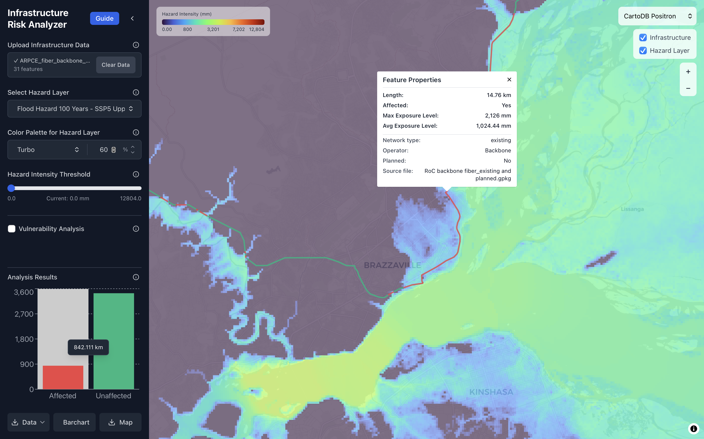

**Vulnerability analysis view** — with the vulnerability toggle enabled, the user uploads a flood damage curve CSV and enters a fiber replacement cost. The same map now shades each segment by its estimated damage percentage, and the bar chart extends to show estimated total damage cost (USD) alongside exposure and vulnerability rates.

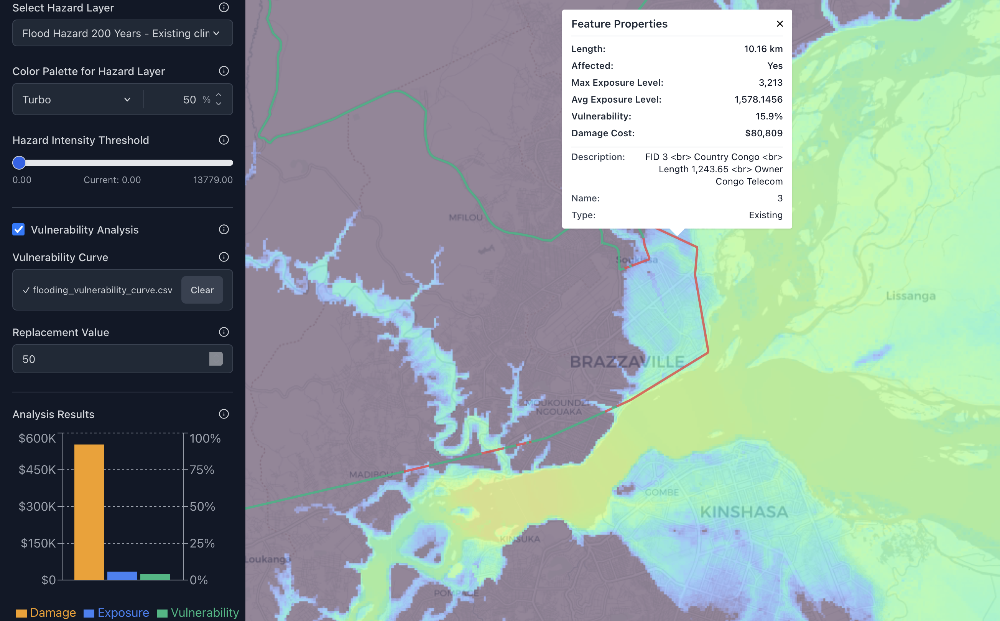

---

## Results: fiber-optic network — flood exposure and vulnerability

The results presented here are for the **100-year return period flood** scenario, a severe but not exceptional event that is the primary reference case in our analysis. We compare results across two climate scenarios: existing climate (W5E5 historical baseline) and the SSP5 upper bound (RCP8.5/ISIMIP3b), which represents a high-emissions future and provides an upper bound on climate-driven risk amplification.

### Exposure

Of the total fiber network length (~4.28 million meters), approximately **729,674 meters — or 17.0%** — fall within the 100-year flood hazard zone under existing climate conditions. Under the SSP5 upper bound, this rises to **794,718 meters (18.6%)**, an 8.9% increase driven by intensification of riverine flooding along the same northern corridor.

<table>
<tr>
<th>Flood hazard, 100 yr return period, existing climate</th>
<th>Flood hazard, 100 yr return period, SSP5 upper bound</th>
</tr>
<tr>
<td>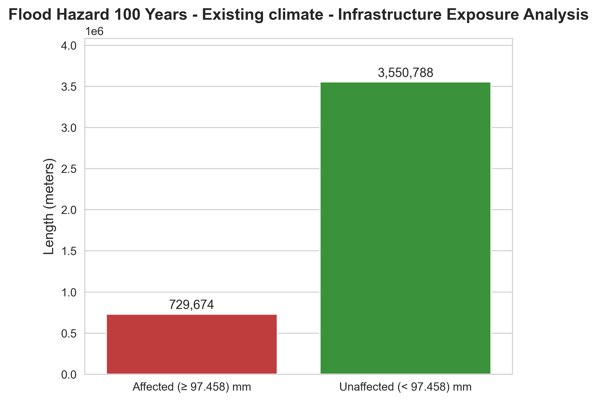</td>
<td>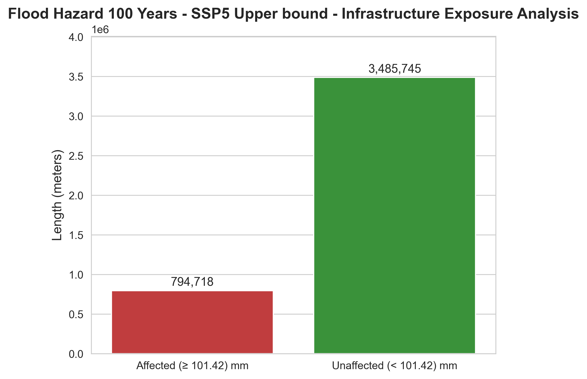</td>
</tr>
</table>

The spatial pattern on the exposure map is straightforward. The vast majority of the network runs through terrain with low flood hazard, shown in green. The exposed segments, shown in red, are concentrated in the **north of the country** — particularly in the Sangha and Likoula departments — where the network crosses the extensive wetlands and floodplains of the Congo Basin tributaries. A secondary cluster appears near **Brazzaville**, where the network passes through low-lying areas adjacent to the Congo River.

<table>
<tr>
<th>Flood hazard, 100 yr return period, existing climate</th>
<th>Flood hazard, 100 yr return period, SSP5 upper bound</th>
</tr>
<tr>
<td>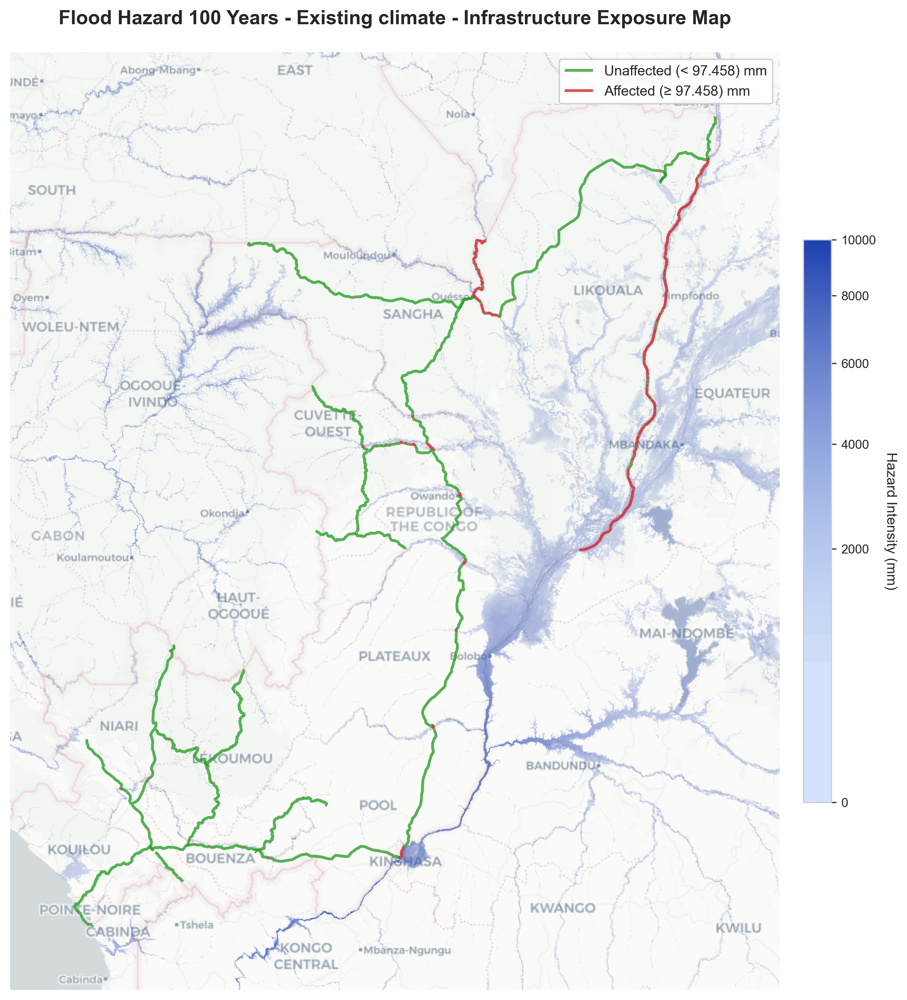</td>
<td>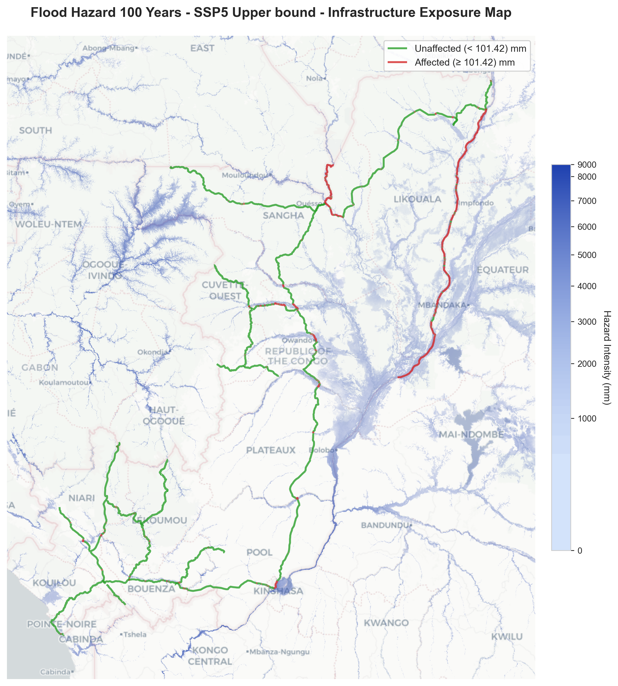</td>
</tr>
</table>

The geographic concentration of risk is a critical finding: the most exposed parts of the backbone are precisely those connecting the capital to the north of the country. These segments already operate with limited redundancy, and repair access during a flood event would be logistically challenging.

### Vulnerability

Applying the flood depth–damage curve (Nirandjan et al., 2024) to the exposed segments translates physical exposure into estimated economic loss. Under existing climate conditions, a 100-year flood event could cause approximately **$14.8 million in direct fiber damage** — a damage ratio of **38.1%** of total fiber asset value. Under the SSP5 scenario, estimated damage rises to **$16.3 million** (38.0% damage ratio), driven by the higher share of network within the inundation zone.

<table>
<tr>
<th>Flood hazard, 100 yr return period, existing climate</th>
<th>Flood hazard, 100 yr return period, SSP5 upper bound</th>
</tr>
<tr>
<td>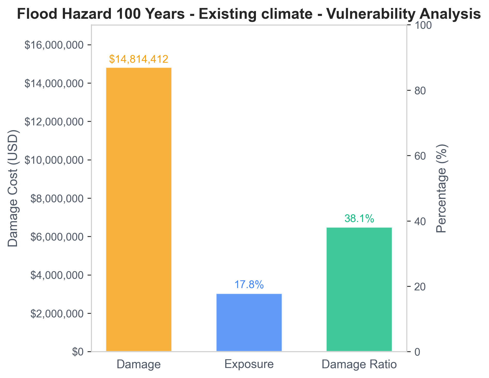</td>
<td>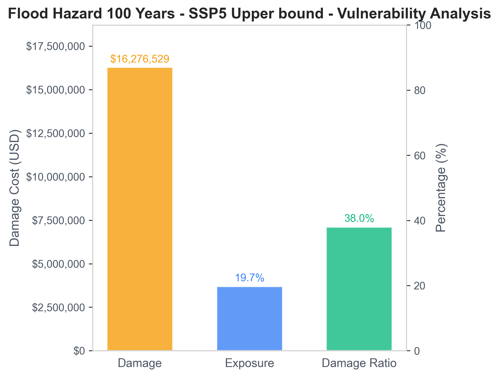</td>
</tr>
</table>

The damage ratio accounts for the full distribution of inundation depths along the exposed network, not just whether a segment crosses the threshold. Segments experiencing shallower inundation incur only partial damage, while those in the deep-inundation zones of the northern river systems approach or exceed the 50% damage threshold. The vulnerability map shows this distribution: the orange-red segments in the Likoula and Sangha departments carry the highest per-segment damage estimates.

<table>
<tr>
<th>Flood hazard, 100 yr return period, existing climate</th>
<th>Flood hazard, 100 yr return period, SSP5 upper bound</th>
</tr>
<tr>
<td>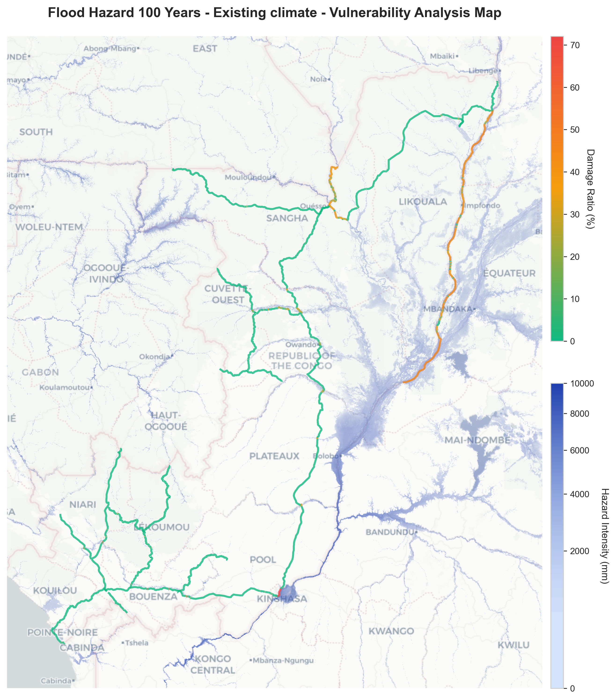</td>
<td>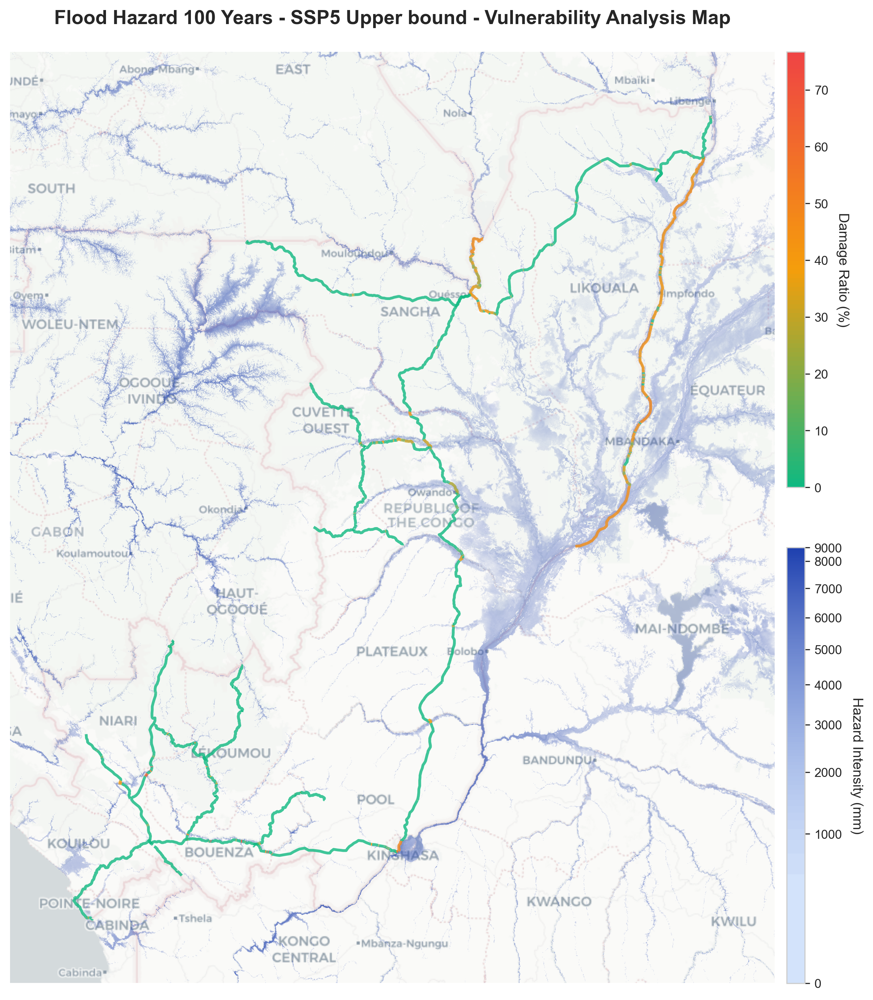</td>
</tr>
</table>

Nearly $15 million in potential fiber damage from a single 100-year flood makes a strong case for why climate risk screening of backbone infrastructure matters. A disruption of this scale would represent a significant direct capital loss and could sever data connectivity for entire northern regions during precisely the periods when emergency coordination and communications are most critical.

---

## Results: fiber-optic network — landslide exposure and vulnerability

Landslides present a different risk profile from flooding. Flood exposure clusters in flat, low-lying areas near river systems; landslide susceptibility is highest in hilly terrain, particularly along road and rail corridors where the national fiber backbone is often co-located.

### Exposure

Under existing climate conditions, **249,364 meters — 5.8%** of the fiber network — traverses terrain with elevated precipitation-triggered landslide susceptibility (class ≥ 1.5 on the CDRI GIRI five-class scale). The SSP5 upper bound produces a modest increase to **252,253 meters (5.9%)**. The small change between scenarios reflects the fact that landslide susceptibility in Congo is driven primarily by topography and soil type, not rainfall variability at the 100-year level.

<table>
<tr>
<th>Landslide hazard, existing climate</th>
<th>Landslide hazard, SSP5 upper bound</th>
</tr>
<tr>
<td>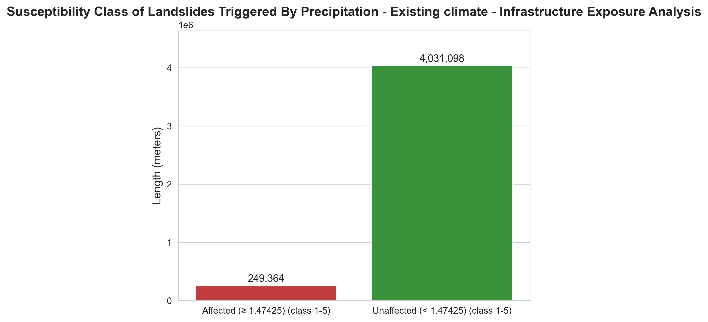</td>
<td>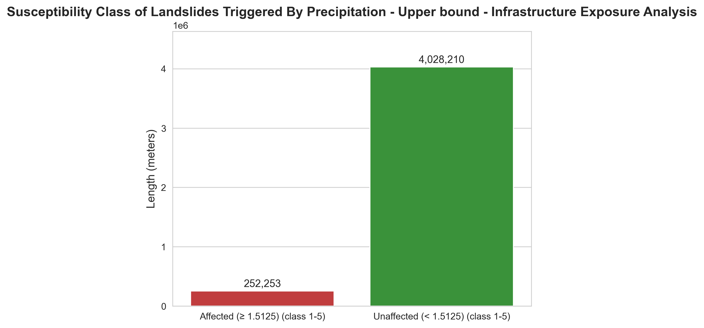</td>
</tr>
</table>

The exposure map shows landslide-exposed segments concentrated along the elevated terrain in the interior of the country, particularly in the Plateaux and Pool departments, where the network traverses hilly ground on its routes between Brazzaville and the northern regions.

<table>
<tr>
<th>Landslide hazard, existing climate</th>
<th>Landslide hazard, SSP5 upper bound</th>
</tr>
<tr>
<td></td>
<td></td>
</tr>
</table>

### Vulnerability

Applying a step-function damage curve calibrated to landslide susceptibility classes, we estimate **$3.33 million in potential direct fiber damage** under existing climate conditions — a damage ratio of **22.6%** of total fiber asset value. Under the SSP5 scenario, this rises marginally to **$3.37 million** (22.6% damage ratio), consistent with the negligible change in susceptibility patterns between scenarios.

<table>
<tr>
<th>Landslide hazard, existing climate</th>
<th>Landslide hazard, SSP5 upper bound</th>
</tr>
<tr>
<td>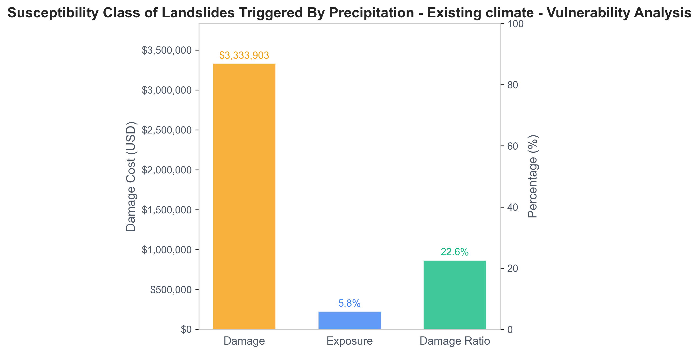</td>
<td></td>
</tr>
</table>

The combination of flood and landslide risk matters most for the segments connecting Brazzaville to the north: these sections face compound exposure from both hazard types, are the hardest to repair quickly, and carry the only backbone connectivity for large areas of the country. A failure during a flood or landslide event could have cascading effects on mobile network backhaul, emergency services, and financial transactions in affected departments.

<table>
<tr>
<th>Landslide hazard, existing climate</th>
<th>Landslide hazard, SSP5 upper bound</th>
</tr>
<tr>
<td></td>
<td></td>
</tr>
</table>

---

## Results: mobile tower network — flood exposure and vulnerability

Congo's 1,594 mobile tower sites face a different risk geometry than the fiber backbone. The network consists of discrete point assets spread across the country, so exposure figures translate directly into site counts — making it possible to link results to individual towers that may need targeted intervention.

### Exposure

Under existing climate, **188 of the 1,594 tower sites — 11.8%** — exceed the 100 mm inundation threshold under a 100-year flood. The SSP5 scenario produces a somewhat counterintuitive result: exposed sites fall to **171 (10.7%)** rather than rising as they do for the fiber backbone. Several sites sit close to the 100 mm threshold, and under the SSP5 hazard layer their projected depths fall just below it rather than above, illustrating how binary exposure classification behaves for point assets near hazard gradients.

<table>
<tr>
<th>Flood hazard, 100 yr return period, existing climate</th>
<th>Flood hazard, 100 yr return period, SSP5 upper bound</th>
</tr>
<tr>
<td>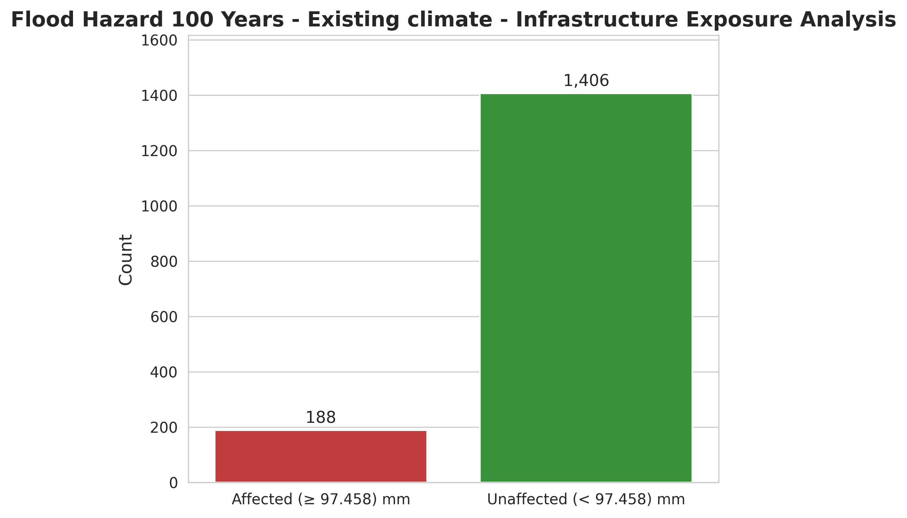</td>
<td>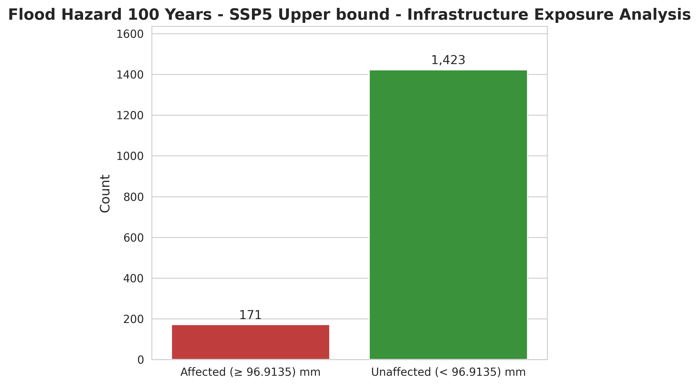</td>
</tr>
</table>

Spatially, exposed towers cluster in the same areas identified for the fiber backbone: the **northern Sangha and Likouala departments**, where towers sit within the Congo River tributary floodplains, and a secondary concentration near **Brazzaville** along the river crossing. Tower sites in Pointe-Noire, Niari, and Bouenza are largely unaffected.

<table>
<tr>
<th>Flood hazard, 100 yr return period, existing climate</th>
<th>Flood hazard, 100 yr return period, SSP5 upper bound</th>
</tr>
<tr>
<td>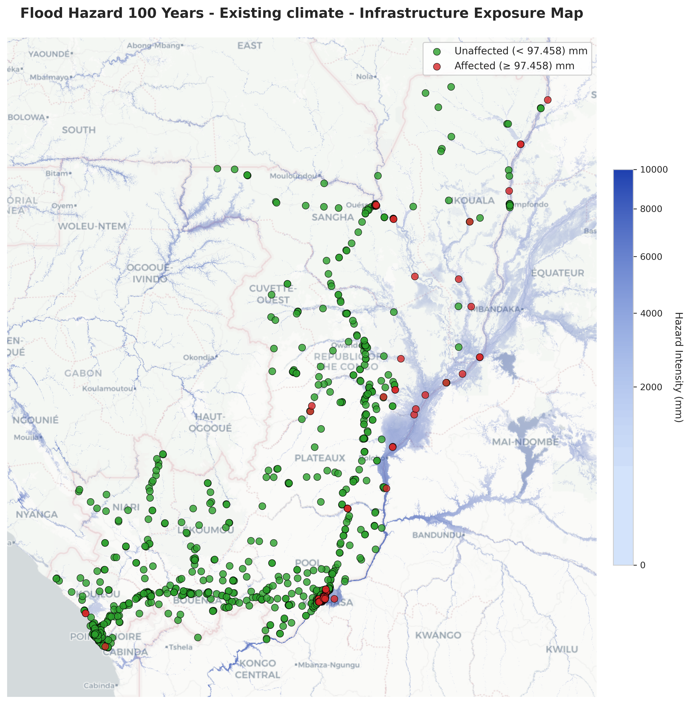</td>
<td></td>
</tr>
</table>

### Vulnerability

Applying the flood depth–damage curve to the exposed tower sites, we estimate **USD 8.6 million in direct damage** to the mobile tower network under existing climate — with 11.8% of sites exposed and a damage ratio of **45.6%** across those sites. The high damage ratio relative to the exposure rate comes from the geography: the most exposed sites, in the northern floodplains, experience severe inundation depths that push individual damage estimates close to 100%.

Under SSP5, estimated damage falls to **USD 6.0 million**, with 10.7% of sites exposed and a damage ratio of **34.4%**. This decrease mirrors the reduction in exposed site count and again reflects threshold-sensitivity for point assets rather than any genuine reduction in underlying flood hazard.

<table>
<tr>
<th>Flood hazard, 100 yr return period, existing climate</th>
<th>Flood hazard, 100 yr return period, SSP5 upper bound</th>
</tr>
<tr>
<td>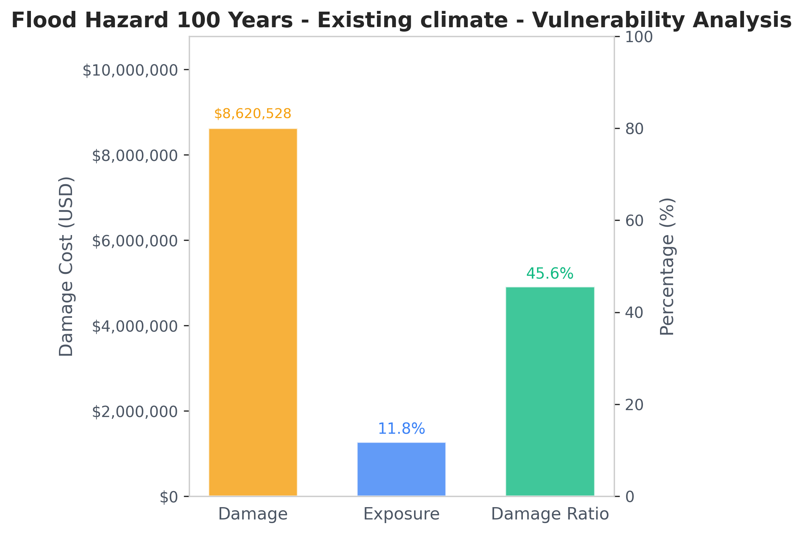</td>
<td>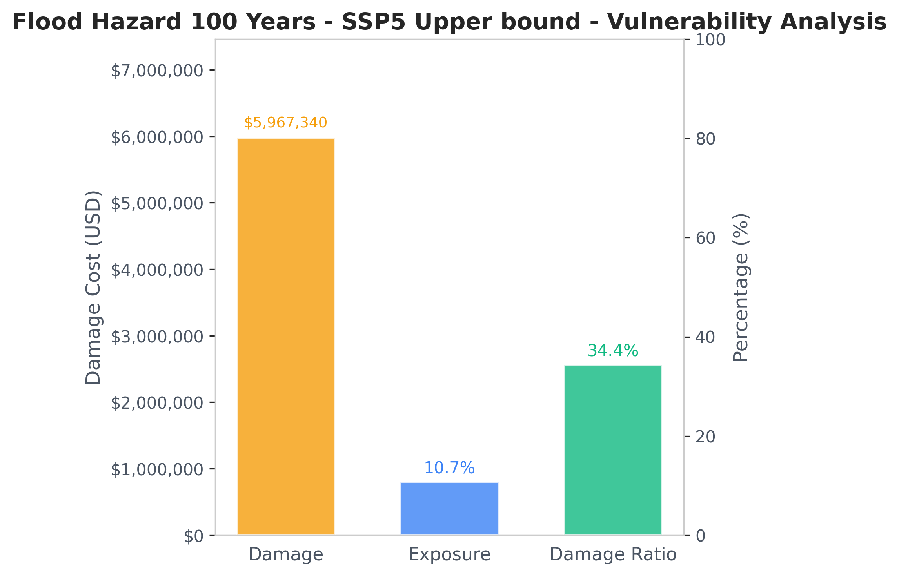</td>
</tr>
</table>

<table>
<tr>
<th>Flood hazard, 100 yr return period, existing climate</th>
<th>Flood hazard, 100 yr return period, SSP5 upper bound</th>
</tr>
<tr>
<td>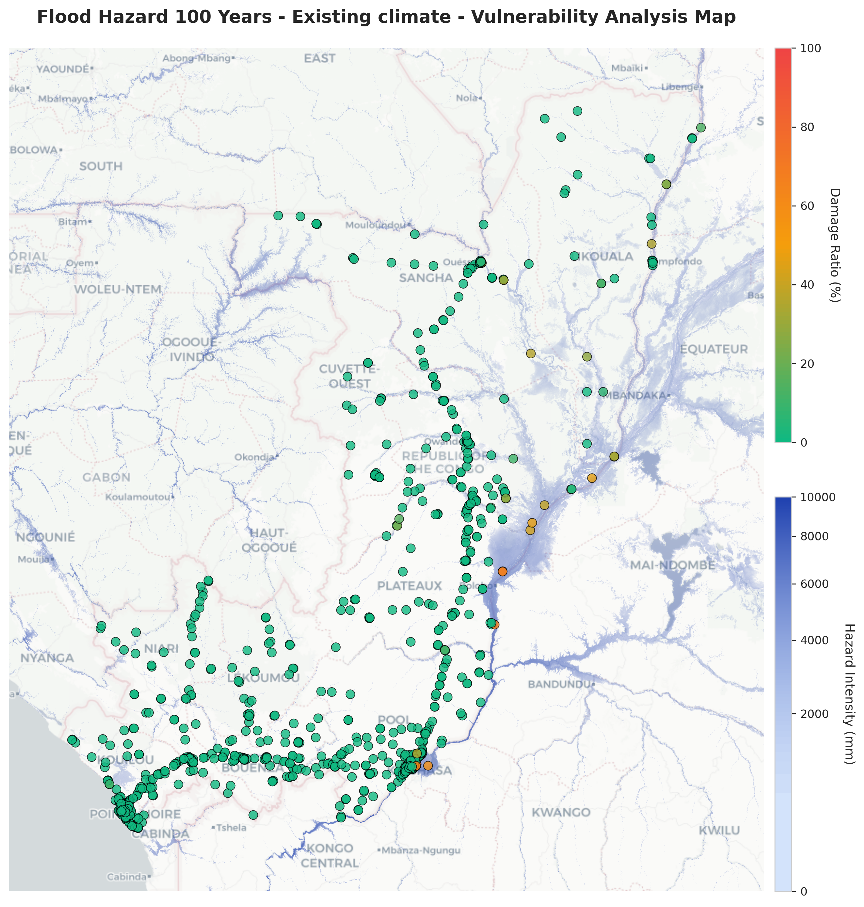</td>
<td></td>
</tr>
</table>

---

## Results: mobile tower network — landslide exposure and vulnerability

### Exposure

Landslide susceptibility affects a smaller share of the tower network than flooding. Under existing climate, **76 of the 1,594 tower sites — 4.8%** — sit in terrain with susceptibility class above 1.5. The SSP5 scenario shows a marginal increase to **77 sites (4.8%)**, consistent with the finding that projected rainfall changes under high-emissions scenarios have limited effect on landslide susceptibility patterns, which in Congo are driven primarily by topography and soil type.

Exposed towers are distributed across the elevated interior of the country — concentrated in the **Pool, Bouenza, and Niari departments** in the south, including the corridor approaching Pointe-Noire, with a smaller number scattered across the northern uplands. The pattern is more geographically dispersed than flood exposure, which is anchored to identifiable river floodplains.

<table>
<tr>
<th>Landslide hazard, existing climate</th>
<th>Landslide hazard, SSP5 upper bound</th>
</tr>
<tr>
<td>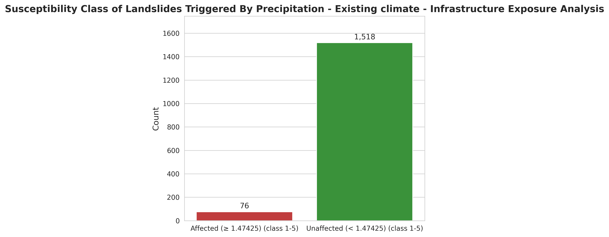</td>
<td></td>
</tr>
</table>

<table>
<tr>
<th>Landslide hazard, existing climate</th>
<th>Landslide hazard, SSP5 upper bound</th>
</tr>
<tr>
<td></td>
<td></td>
</tr>
</table>

### Vulnerability

The step-function damage curve applied to landslide susceptibility classes yields an estimated **USD 2.05 million in direct tower damage** under existing climate, with a damage ratio of **27.0%** across exposed sites. Under SSP5, this rises marginally to **USD 2.08 million** (damage ratio 26.9%).

Flood risk affects a larger share of the tower network, but the damage ratio on landslide-exposed sites is comparable — towers in high-susceptibility zones face severe consequences when affected. The dispersed geographic pattern of landslide risk, unlike the northern concentration of flood risk, means that reducing it requires network-wide attention to site resilience rather than targeted interventions at a handful of identifiable locations.

<table>
<tr>
<th>Landslide hazard, existing climate</th>
<th>Landslide hazard, SSP5 upper bound</th>
</tr>
<tr>
<td>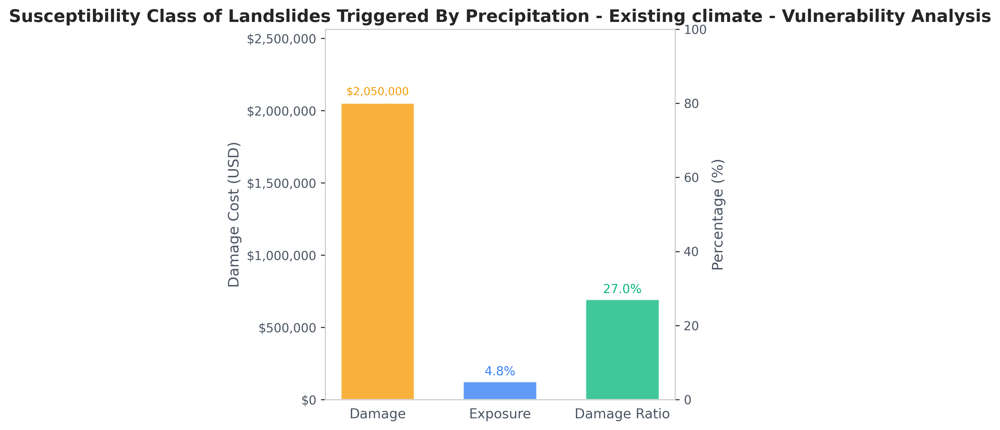</td>
<td>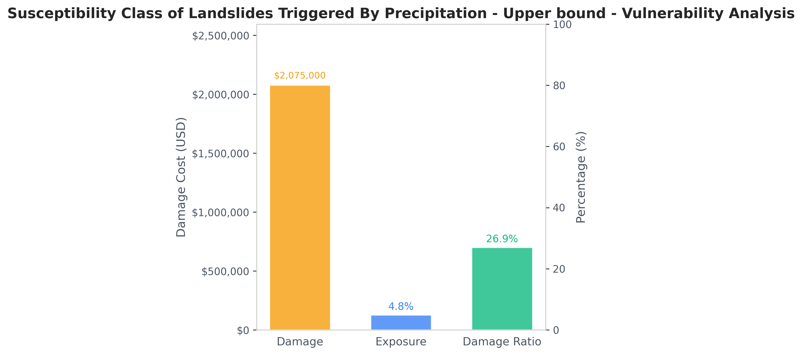</td>
</tr>
</table>

<table>
<tr>
<th>Landslide hazard, existing climate</th>
<th>Landslide hazard, SSP5 upper bound</th>
</tr>
<tr>
<td></td>
<td></td>
</tr>
</table>

---

## Results: datacenters and submarine cable landing stations

### Datacenters — flood exposure

We assessed Congo's seven datacenter sites for exposure to the 100-year riverine flood hazard, using the same 100 mm inundation threshold applied to the fiber and tower analysis. Of the seven sites, five are operational, one is under construction in Brazzaville, and one is a planned backup facility in Oyo.

**3 of the 7 sites (43%)** exceed the inundation threshold under existing climate. Under SSP5, the result does not change: the same 3 sites remain exposed. This contrasts with the fiber and tower results, where the SSP5 hazard layer shifts which assets cross the threshold. For datacenters, both the number and the identity of the exposed sites are stable across both scenarios.

<table>
<tr>
<th>Flood hazard, 100 yr return period, existing climate</th>
<th>Flood hazard, 100 yr return period, SSP5 upper bound</th>
</tr>
<tr>
<td></td>
<td>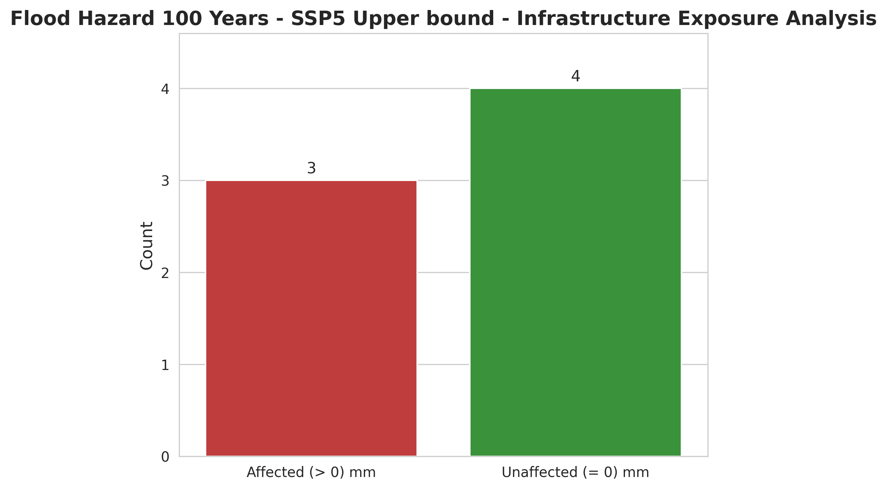</td>
</tr>
</table>

All three exposed sites are in the **Brazzaville area**, close to the Congo River. Of the four datacenter sites around Brazzaville, three sit near the riverbank and are exposed; the fourth, set back from the river, is not. The two datacenter sites in Pointe-Noire and the planned backup site in Oyo show no flood exposure under either scenario.

<table>
<tr>
<th>Flood hazard, 100 yr return period, existing climate</th>
<th>Flood hazard, 100 yr return period, SSP5 upper bound</th>
</tr>
<tr>
<td>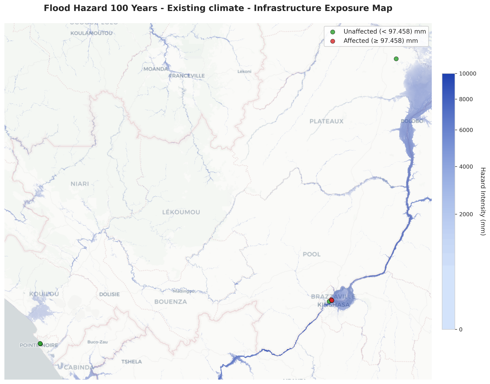</td>
<td>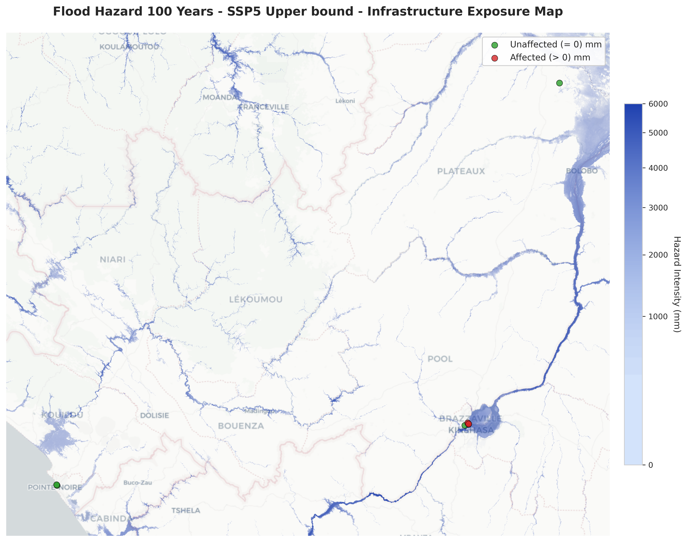</td>
</tr>
</table>

The analysis for datacenters covers exposure only. Depth-damage curves and replacement cost estimates for datacenter facilities were not available for this study, so we do not provide damage or financial loss estimates for the exposed sites. We also checked all seven sites against the landslide susceptibility threshold; none exceed it under either scenario, so we do not include a landslide section for datacenters.

### Submarine cable landing stations

Congo has two submarine cable landing stations, both in Loango on the coast near Pointe-Noire: the WACS station, operational since 2012, and the 2Africa station, commissioned in 2026. Neither site exceeds the flood inundation threshold or the landslide susceptibility threshold under existing climate or SSP5. Because neither hazard exposes these sites, we do not include an exposure or vulnerability analysis for cable landing stations in this report.

---

## Summary and conclusion

The analysis presented here covers Congo's four core digital infrastructure asset classes — the fiber backbone, the mobile tower network, datacenter facilities, and submarine cable landing stations — across two hazard types and two climate scenarios. A few findings stand out as priorities for investment planning.

The **northern backbone corridor** (Sangha and Likoula departments) carries the highest risk concentration in the network. Up to 17–19% of total fiber length falls within the 100-year flood hazard zone, the majority in the north where the network crosses Congo Basin tributary floodplains. A severe flood event could sever connectivity between the capital and entire northern regions at a replacement cost approaching $15 million. The tower network follows the same pattern: the highest-exposure sites are also in the north. Route diversification, targeted burial of aerial segments, and hardened duct infrastructure at flood-prone river crossings would reduce the most concentrated risks.

**Datacenters in Brazzaville** present a specific concentration risk: three of the four Brazzaville-area sites, and 43% of the national datacenter inventory, sit within the flood hazard zone. These facilities host financial systems and government data, with no backup alternatives currently operating outside the at-risk area. The absence of damage curves means we cannot yet quantify the financial exposure, but the proximity to the Congo River warrants detailed site-level assessments and flood-proofing measures for the affected facilities.

**Compound hazard exposure** on the Brazzaville–north corridor deserves particular attention. Some fiber segments face both elevated flood and landslide susceptibility. These double-exposed sections warrant priority site-level surveys, since global hazard models inevitably underestimate localized risks near river banks and along road cuttings.

The **SSP5 climate change scenarios** produce a meaningful but not dramatic amplification of risk for the fiber network — roughly a 2-percentage-point increase in flood exposure (17% to 19%) and a $1.5 million increase in estimated flood damage. For the tower network, the SSP5 effect on flood exposure is slightly negative (a threshold-sensitivity artifact), while landslide risk is nearly unchanged. The overall picture is that baseline exposure is already substantial and warrants near-term investment, with the climate signal justifying resilience margins for new infrastructure.

The **[Infrastructure Risk Analyzer](https://datanalytics.worldbank.org/infra-risk-analyzer/)** is available as a public web tool — no GIS software or programming required. Upload an infrastructure dataset, select a hazard layer and threshold, and the app returns an interactive exposure map and summary chart in seconds. With an optional damage curve and replacement cost, it extends to full financial loss estimates. We are already adapting the approach for use in East Africa, and the tool is designed to be reused as infrastructure inventories improve or new hazard products become available. If you work on infrastructure resilience in a similar context, we encourage you to try it.

We will present the full diagnostic report, including a synthesis of investment priorities and methodology documentation, at a stakeholder workshop in mid-2026.

---

*This work is financed by the Government of Japan through the Quality Infrastructure Investment (QII) Partnership, a World Bank Executed Trust Fund. The authors thank the ARPCE telecommunications regulator and the operators Airtel Congo and MTN Congo for sharing infrastructure data.*
